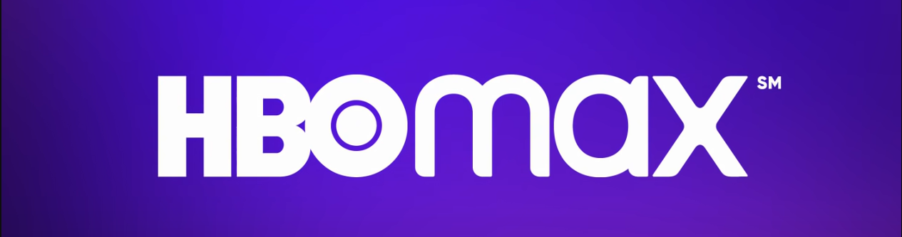

<div align="center">



# 🎬 Clone HBO Max

Projeto desenvolvido durante a **Formação CSS Developer** da **DIO**, recriando a interface do HBO Max utilizando apenas **HTML5** e **CSS3**, com foco em responsividade, animações e organização de código.

<br>


</div>

---

## 📖 Sobre o projeto

Este projeto consiste em um clone da landing page do **HBO Max**, reproduzindo sua identidade visual e adicionando algumas melhorias na estrutura e organização do código.

Durante o desenvolvimento foram aplicados diversos conceitos de CSS moderno, incluindo animações, Flexbox, Grid Layout, responsividade e efeitos visuais.

---

## 🚀 Tecnologias utilizadas

- HTML5
- CSS3
- Flexbox
- CSS Grid
- Media Queries
- CSS Animations
- CSS Variables

---

## ✨ Funcionalidades

- Header fixo
- Banner principal (Hero)
- Cards dos planos
- Catálogo de filmes e séries
- Página de login
- Footer completo
- Layout totalmente responsivo
- Efeitos Hover
- Animações em CSS
- Gradientes e efeitos visuais

---

## 📱 Responsividade

O projeto foi desenvolvido para diferentes tamanhos de tela:

- 💻 Desktop
- 📱 Smartphone
- 📲 Tablet

---

## 🎯 Conceitos praticados

- Estrutura semântica HTML
- Organização de arquivos CSS
- Posicionamento com Flexbox
- Layouts utilizando CSS Grid
- Pseudo-classes
- Pseudo-elementos
- Variáveis CSS
- Animações (@keyframes)
- Transições
- Media Queries

---

## 📂 Estrutura do projeto

```text
Clone_HBOMax
│
├── assets
│   ├── css
│   ├── images
│
├──signin.html
│
├── index.html
│
└── README.md
```

---

## 📸 Preview

| Página Inicial |
|----------------|
|  |

<br>

| Projeto Completo |
|------------------|
|  |

---

## 👨‍💻 Autor

**Loren Eisfeld Conde Rosa**

[](https://www.linkedin.com/in/loren-eisfeld-conde-rosa-4a12171b5/)

[](https://github.com/Lorenconde)

---

## 📚 Créditos

Projeto desenvolvido como desafio da **Formação CSS Developer** da **Digital Innovation One (DIO)**.

Baseado no projeto disponibilizado pela especialista Michele Ambrosio, com adaptações e melhorias implementadas durante o desenvolvimento.
